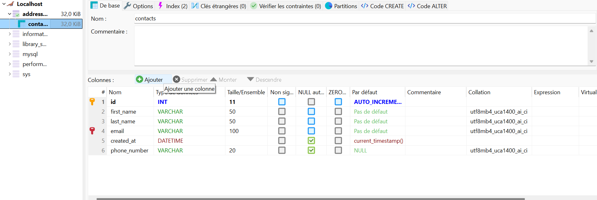
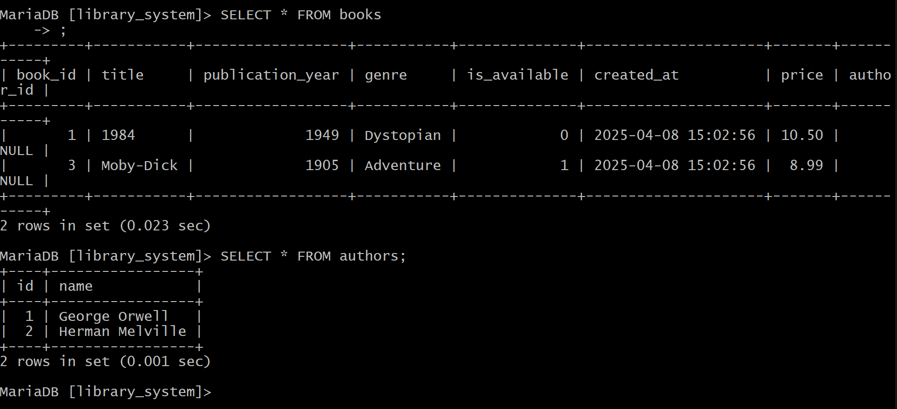
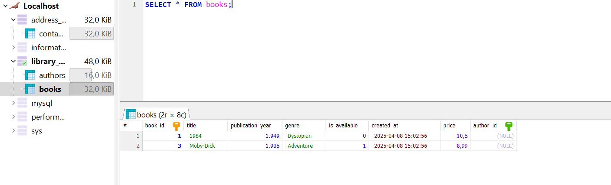

# Exercices about SQL with terminal or HeidiSQL

## What's this ?

Two exercices to learn SQL with basics command on terminal and discover Heidi SQL to manipulate DB.

### Exercise 1

First in terminal create and manipulate a unique tables with basics command :

Same in Heidi SQL :

### Exercise 2

Second exercise with two tables manipulate with intermediate SQL command on terminal :

Same on Heidi SQL :

#### Thanks you for read this README and look this repo !!!
