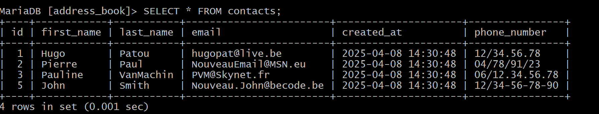

# Exercices about SQL with terminal or HeidiSQL

## What's this ?

Two exercices to learn SQL with basics command on terminal and discover Heidi SQL to manipulate DB.

### Exercise 1

First in terminal create and manipulate a unique tables with basics command :

Same in Heidi SQL :

### Exercise 2

Second exercise with two tables manipulate with intermediate SQL command on terminal :

Same on Heidi SQL :

### BONUS

After, there are a series of exercises on the [site](https://sql.sh/exercices-sql).

First, on a DB about cities and department of FRANCE.
Second, on a DB about a series of clients and commands in a fictious company.

#### Thanks you for read this README and look this repo !!!
